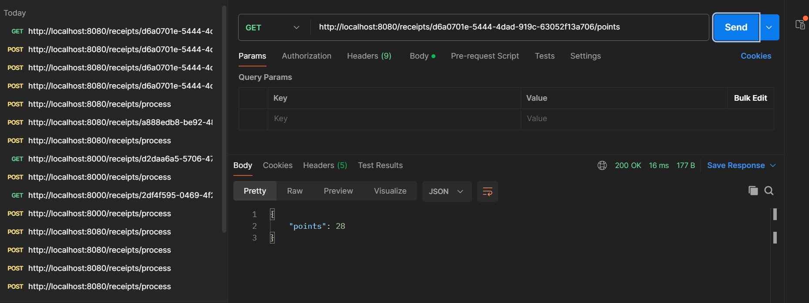
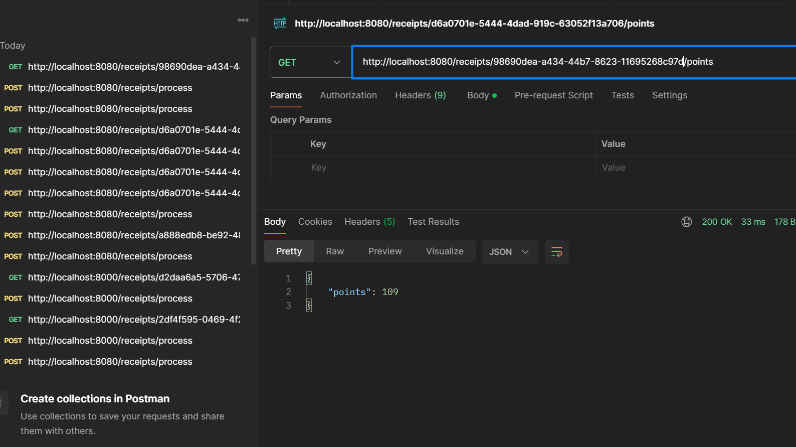

# Fetch Rewards technical-assessment.

This project is a Spring Boot application that uses an H2 in-memory database. The application has been dockerized for easy deployment.

## Prerequisites

- Docker

## Building and Running the Application

## Step1: Clone the Repository:
   
   ```bash
   git clone <repository-url>
   cd <repository-folder>
   ````

## Step 2: Build the Docker Image
Run the following command to build the Docker image:

```bash
docker build -t api-application:latest .
```

## Step 3: Run the Docker Container
Run the following command to start your container:

```bash
docker run -p 8080:8080 api-application:latest
```

## Step 4: Access the Application and H2 Console
Once the container is running, you can access the following:

>Application: http://localhost:8080
>H2 Console: http://localhost:8080/h2-console

For the H2 Console, use the following credentials:

>JDBC URL: jdbc:h2:mem:testdb
>Username: sa
>Password: password

## Step 5: POST and GET requests for testing output.

```

curl --location 'http://localhost:8080/receipts/process' \
--header 'Content-Type: application/json' \
--data '{
  "retailer": "Target",
  "purchaseDate": "2022-01-01",
  "purchaseTime": "13:01",
  "items": [
    {
      "shortDescription": "Mountain Dew 12PK",
      "price": "6.49"
    },{
      "shortDescription": "Emils Cheese Pizza",
      "price": "12.25"
    },{
      "shortDescription": "Knorr Creamy Chicken",
      "price": "1.26"
    },{
      "shortDescription": "Doritos Nacho Cheese",
      "price": "3.35"
    },{
      "shortDescription": "   Klarbrunn 12-PK 12 FL OZ  ",
      "price": "12.00"
    }
  ],
  "total": "35.35"
}'

```



```
curl --location 'http://localhost:8080/receipts/process' \
--header 'Content-Type: application/json' \
--data '{
  "retailer": "M&M Corner Market",
  "purchaseDate": "2022-03-20",
  "purchaseTime": "14:33",
  "items": [
    {
      "shortDescription": "Gatorade",
      "price": "2.25"
    },{
      "shortDescription": "Gatorade",
      "price": "2.25"
    },{
      "shortDescription": "Gatorade",
      "price": "2.25"
    },{
      "shortDescription": "Gatorade",
      "price": "2.25"
    }
  ],
  "total": "9.00"
}'
```




---

# Docker Commands Reference

Stop a Running Container
```bash
docker ps
docker stop <container-id>
```
Remove a Container
```bash
docker rm <container-id>
```
List Docker Images
```bash
docker images
```

Remove a Docker Image
```bash
docker rmi api-application:latest
```

View Logs of a Running Container
```bash
docker logs <container-id>
```
Troubleshooting

If you encounter issues with the H2 Console, ensure the container is running and that the correct port is mapped.\
Use docker ps to check if the container is running.\
Verify application logs using 
```bash
docker logs <container-id>.
```

---

# Assumptions for API Application

This document outlines the key assumptions made during the development of the API application using Spring Boot and H2 in-memory database.

---

## General Assumptions

1. **Stateless Application**:
   - The application does not persist data across restarts.
   - The H2 in-memory database is used, and all data is reset when the application restarts.

2. **In-Memory Database**:
   - H2 is used as an in-memory database for simplicity and development purposes.
   - Data is not stored permanently and will be lost when the application stops.

---

## Points Calculation Assumptions

The points calculation logic follows these rules and assumptions:

1. **Retailer Name**:
   - 1 point for each **alphanumeric character** in the retailer's name.
   - Non-alphanumeric characters (e.g., `&`, spaces) are not counted.

2. **Round Dollar Amount**:
   - 50 points are awarded if the total amount is a whole number (e.g., `9.00`).
   - A total of `9.00` is treated as a round dollar amount.

3. **Multiple of 0.25**:
   - 25 points are awarded if the total is divisible by `0.25` without a remainder.
   - Both round totals and decimal totals (e.g., `9.00`, `8.75`) are considered.

4. **Item Pairs**:
   - 5 points are awarded for every pair of items listed on the receipt.
   - E.g., 4 items result in 10 points (2 pairs × 5 points).

5. **Item Description**:
   - If the trimmed length of an item description is a **multiple of 3**, multiply the item's price by `0.2` and round up to the nearest integer to determine points.
   - Each qualifying item description contributes individually to the total points.

6. **Purchase Date (Odd Day)**:
   - No points are awarded for even purchase dates.
   - 6 points are awarded only if the purchase date's day is odd.

7. **Purchase Time**:
   - 10 points are awarded if the purchase time falls between **2:00 PM and 4:00 PM**.
   - Times are inclusive, meaning `14:00` to `15:59` (24-hour format).

---

## Application Assumptions

1. **Request Validation**:
   - The application assumes that all incoming requests are well-formed.
   - No additional validation (e.g., missing fields, invalid types) is performed unless explicitly mentioned.

2. **Unique Receipt IDs**:
   - Each receipt is assigned a unique identifier (UUID).
   - The ID is returned upon processing and is used to fetch points.

3. **H2 Console**:
   - Enabled for development purposes at `/h2-console`.
   - Not recommended for production environments.

4. **Error Handling**:
   - If a receipt ID is not found, a generic `Receipt not found` error is returned.

5. **Dockerization**:
   - The application assumes a single-container deployment, with no external dependencies beyond the container.

---

## Technical Assumptions

1. **Java Version**:
   - The application is developed and tested with **Java 17**.

2. **Port Configuration**:
   - The default application port is **8080**.
   - The H2 console is also accessible via port **8080**.

3. **Docker Usage**:
   - The Docker image assumes the application JAR is built as `apiApplication-0.0.1-SNAPSHOT.jar`.

---

## Future Considerations

- For production, consider using a persistent database (e.g., PostgreSQL or MySQL) to retain data across restarts.
- Implement robust request validation and error handling for invalid inputs.
- Use environment variables to configure database credentials and application 

